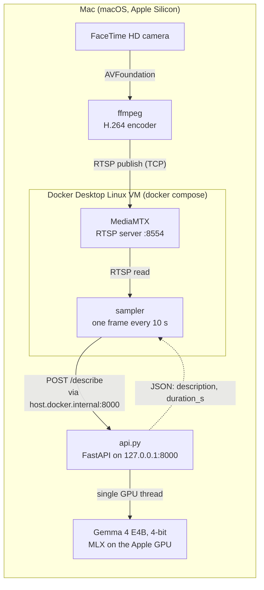

# Local camera assistant

A Mac's webcam films, a vision-language model running locally (Gemma via Apple's MLX) describes what it sees every 10 seconds, and the whole thing is deployed like production infrastructure: docker compose today, then CI, Kubernetes, network isolation, monitoring and GitOps.

No frame is sent to a cloud API: the video stream, the frames and the model all stay on the Mac.

## What works

- Phase 1: a local API (FastAPI + Gemma via MLX) receives an image and returns a description of it.
- Phase 2: the webcam is streamed over RTSP through MediaMTX, running in Docker.
- Phase 2: a sampler container grabs a frame from the stream every 10 s, sends it to the API and logs the description.
- Phase 2: `./start.sh` starts everything with one command (API, webcam stream, and MediaMTX + sampler with docker compose); Ctrl+C stops it all, camera included.
- Phase 3: a GitHub Actions workflow builds the sampler image on every push.
- Phase 3: Trivy scans the image in CI and fails the pipeline on any fixable critical vulnerability.

## Architecture



1. **ffmpeg** captures the webcam, encodes it to H.264 and publishes it over RTSP to MediaMTX.
2. **MediaMTX** (container) receives the stream and serves it to any reader, like a surveillance camera would.
3. **The sampler** (container) connects to the stream every 10 s, decodes one frame, disconnects, and sends the frame as a JPEG to the API. The JPEG is built in memory and never written to disk.
4. **The API** runs the model on the Apple GPU and returns the description with the time it took. The sampler writes it to its logs.

## Why the model runs outside Docker

Docker Desktop on macOS doesn't run containers on macOS itself: it runs them in a Linux virtual machine. That VM has no access to the Apple GPU (Metal), which is what MLX uses to run the model fast. In a container, the model could only run on the CPU and couldn't keep up with a frame every 10 s. Memory is the other limit: the model weighs 4.8 GB, and the Docker VM is capped at about 4 GB so that the model, the containers and macOS fit in the Mac's 16 GB.

So the work is split by what each piece needs:

| Runs on | What | Why |
| --- | --- | --- |
| The Mac | `api.py` and the model | Needs the Apple GPU |
| The Mac | ffmpeg | Needs the webcam, which the VM can't see either |
| Docker | MediaMTX, the sampler (and later the Kubernetes cluster) | Plain Linux workloads: they can be containerized, scanned, scheduled and isolated |

The HTTP API is the boundary between the two worlds: any program, in a container or not, can ask for a description with a `POST /describe`. Containers reach the Mac at `host.docker.internal:8000`. The API listens on `127.0.0.1` only: Docker Desktop still forwards container traffic to it, and it isn't exposed to the local network.

## Design notes

- **One GPU thread.** MLX binds its GPU work to the thread that started it. The API loads the model and runs every generation in a single-worker `ThreadPoolExecutor`, so requests are queued and handled one at a time.
- **A short question.** Response time depends on answer length: about 7 s for one sentence, about 24 s for a detailed description. The sampler asks for one sentence so that it keeps up with the 10 s interval. If a round still runs late, the next one starts right away instead of overlapping.
- **A fresh connection per frame.** The sampler doesn't keep the stream open between rounds, so it describes what the camera sees now, not a frame buffered seconds ago. ffmpeg emits a keyframe every second (`-g 30`) so that a new reader gets a decodable image quickly.
- **A pinned capture mode.** ffmpeg is forced to 1280x720, 30 fps, `yuv420p`. Left to its defaults, it picks the camera's 1552x1552 4:2:2 mode, timestamps advance by 1 tick per frame instead of 3003, and players show a frozen image.
- **A small, unprivileged container.** The sampler image is based on `python:3.14-slim` with pinned dependencies, and runs as a non-root user. It handles `SIGTERM` as PID 1, so `docker stop` doesn't have to wait 10 s and kill it.
- **Errors don't crash the loop.** If the stream or the API is down (startup, restart), the sampler logs the error and tries again at the next round.

## Running it

Requirements: an Apple Silicon Mac, Docker Desktop, ffmpeg (`brew install ffmpeg`) and Python 3.

```bash
git clone https://github.com/Aymiut/local-vision-assistant.git
cd local-vision-assistant
python3 -m venv camenv && source camenv/bin/activate
pip install -r requirements.txt
./start.sh
```

`start.sh` starts the API, MediaMTX, the webcam stream and the sampler, each one once the previous is ready, then follows the sampler's logs: one description every 10 s. Ctrl+C stops everything and turns the camera off. The API's and ffmpeg's logs go to `logs/`.

- The first run downloads the model from Hugging Face (4.8 GB), and macOS asks to allow the terminal to use the camera.
- Ports 8000 and 8554 must be free.
- For a lighter model (3.3 GB): `MODEL=mlx-community/gemma-4-e2b-it-4bit ./start.sh`.
- The sampler is configured through environment variables in `docker-compose.yml`: `STREAM_URL`, `API_URL`, `INTERVAL_S`, `QUESTION`.

### The API on its own

```bash
uvicorn api:app --host 127.0.0.1 --port 8000
curl -F "image=@photo.jpg" localhost:8000/describe
curl -F "image=@photo.jpg" -F "question=In one sentence: what do you see?" localhost:8000/describe
```

The interactive documentation is at `http://localhost:8000/docs`.

## Repository layout

| Path | Role |
| --- | --- |
| `api.py` | HTTP API in front of the model |
| `sampler/` | The sampler: script, Dockerfile, dependencies |
| `docker-compose.yml` | MediaMTX and the sampler |
| `start.sh` | Starts and stops the whole project |
| `analyse.py` | The first command-line prototype (same pipeline, no HTTP) |

## Next steps

- **CI:** GitHub Actions builds the sampler image, Trivy fails the build on critical vulnerabilities, and the image is published to GHCR.
- **Kubernetes:** MediaMTX and the sampler move from docker compose to a k3d cluster.
- **Proving it stays local:** a NetworkPolicy blocks all outbound traffic, except from the sampler to MediaMTX and the API, and a test shows that the Internet is unreachable from the sampler.
- **Monitoring:** the sampler exposes Prometheus metrics (frames processed, model response time, errors), shown in a Grafana dashboard.
- **GitOps:** ArgoCD deploys the `k8s/` folder of this repo, so a push is the only way to change the cluster.
